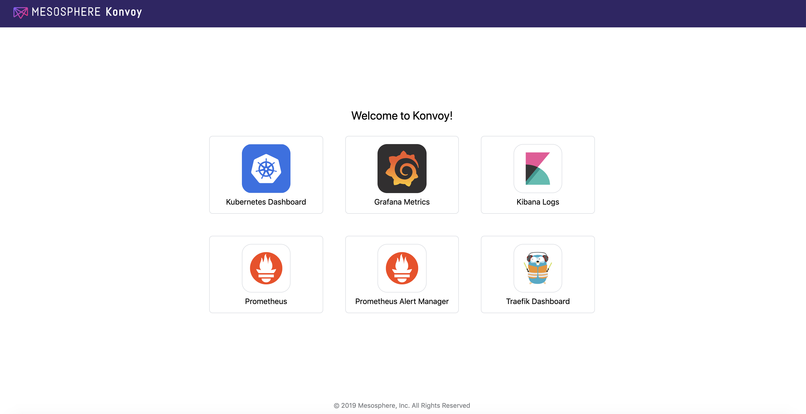
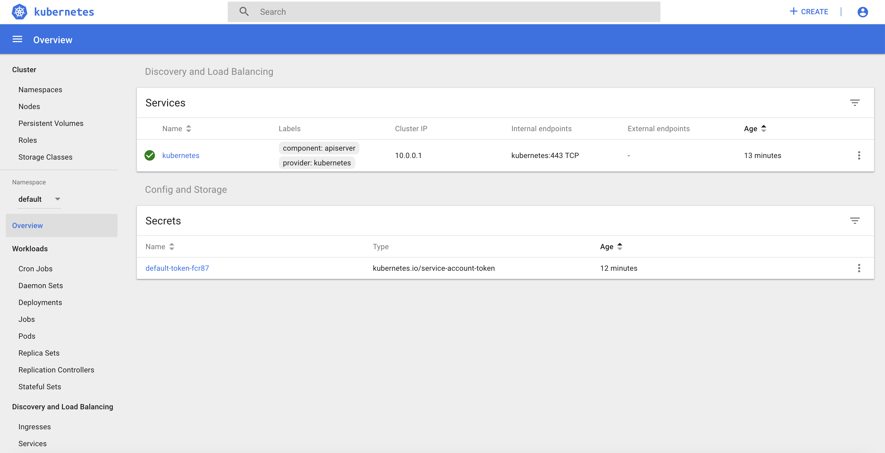

# Kubernetes workshop Day1 

## Introduction

During this workshop, you'll learn how to deploy Kuberenetes using Konvoy and to use its main features:

* [Introduction](#introduction)
* [Prerequisites](#prerequisites)
* [1. Deploy a Kubernetes cluster using Konvoy](#Deploy-a-Kubernetes-cluster-using-Konvoy)
* [2. Deploy a Custom Resource Definition](#Deploy-a-Custom-Resource-Definition)
* [3. Scale Masters/Workers of a k8s cluster](#Scale-Masters/Workers-of-a-k8s-cluster)
* [4. Scale a K8s Application using HPA](#Scale-a-k8s-Application-using-HPA)
* [5. Konvoy logging/debugging](#konvoy-loggingdebugging)
* [5. Ingress troubleshooting](#Ingress-trroubleshooting)
* [6. Upgrade a Kubernetes cluster using Konvoy](#Upgrade-a-kubernetes-cluster-using-Konvoy)

## Prerequisites

You need either a Linux, MacOS or a Windows laptop.

## Jumpserver

Jumpservers have been deployed for each student with all prerequisites installed. First, go to the student data spreadsheet and select a host by entering your name.  Then, download the ssh-private-key (id_rsa_student#) and change the file permissions.  Finally, ssh to the ipaddress of your assigned jumpserver using the -i option to specify the identity file to be used.  The username for the Jumpserver is "centos".

For Mac and Linux clients you must change the permission on the file.
```
chmod 400 id_rsa_student#
```

```
ssh -i id_rsa_student# centos@jumpserver-ip-address
```


>For Windows, you need to use the [Google Cloud Shell](https://console.cloud.google.com/cloudshell).
Once your Google Cloud Shell has started, you will have to copy the contents of you id_rsa_student#.pem file to a local file in the cloud shell.  Then change the permission on the file and ssh into the jump host.


```
vi id_rsa_student#
```
```
chmod 400 id_rsa_student#
```
```
ssh -i id_rsa_student# centos@jumpserver-ip-address
```


## 1. Docker  Containerization Lab

### Containerize a Nodejs application

1. Clone and review the NodeJS application repository from the github   
```bash
git clone https://github.com/Ganasagar/docker-demo.git
```
```bash
cd docker-demo  && ll
```
Output:
```bash
[centos@ip-10-0-1-198 ~]$ cd docker-demo  && ll
total 52
-rw-rw-r-- 1 centos centos   356 Jul  8 19:18 docker-compose.yml
-rw-rw-r-- 1 centos centos    79 Jul  8 19:18 Dockerfile
-rw-rw-r-- 1 centos centos  1055 Jul  8 19:18 index-db.js
-rw-rw-r-- 1 centos centos   316 Jul  8 19:18 index.js
drwxrwxr-x 2 centos centos    66 Jul  8 19:18 misc
-rw-rw-r-- 1 centos centos   397 Jul  8 19:18 package.json
-rw-rw-r-- 1 centos centos 26116 Jul  8 19:18 package-lock.json
-rw-rw-r-- 1 centos centos    34 Jul  8 19:18 README.md
drwxrwxr-x 2 centos centos    21 Jul  8 19:18 test
```
Note: In addition to a typical NodeJS application files you will notice there are two files, Dockerfile and docker-compose.yml, these files define the logic to create a docker image that you will see as you progress

2. Review docker-compose file 
```bash
[centos@ip-10-0-1-198 docker-demo]$ cat docker-compose.yml
web:
  build: .
  command: node index-db.js
  ports:
    - "3000:3000"
  links:
    - db
  environment:
    MYSQL_DATABASE: myapp
    MYSQL_USER: myapp
    MYSQL_PASSWORD: mysecurepass
    MYSQL_HOST: db
db:
  image: orchardup/mysql
  ports:
    - "3306:3306"
  environment:
    MYSQL_DATABASE: myapp
    MYSQL_USER: myapp
    MYSQL_PASSWORD: mysecurepass
```
3. Review Dockerfile file
```bash
cat Dockerfile
```
Output
```bash
[centos@ip-10-0-1-198 docker-demo]$ cat Dockerfile
FROM node:12
WORKDIR /app
ADD . /app
RUN npm install
EXPOSE 3000
CMD npm start
```

4. Modifying the application, Update the message in line 5 of index.js to your liking 
```bash
vim index.js
```
Output:
```bash
  1 var express = require('express');
  2 var app = express();
  3
  4 app.get('/', function (req, res) {
  5   res.send('Darth vader is the Best Vader');
  6 });
  7
  8 var server = app.listen(3000, function () {
  9   var host = server.address().address;
 10   var port = server.address().port;
 11
 12   console.log('Example app listening at http://%s:%s', host, port);
 13 });
```
Note: Line 5 had hellow world previosly which has been changed to a new message instead of hello world.


5. Now that you have the modified the application lets build your own custom image for the application using docker
```bash
docker build .
```
Output: 
```bash
[centos@ip-10-0-1-198 docker-demo]$ docker build .
Sending build context to Docker daemon  118.8kB
Step 1/6 : FROM node:12
 ---> 1fa6026dd8bb
Step 2/6 : WORKDIR /app
 ---> Using cache
 ---> 9908b19b9c8c
Step 3/6 : ADD . /app
 ---> c9ecb96ada38
Step 4/6 : RUN npm install
 ---> Running in f9e198497b8c
added 94 packages from 485 contributors and audited 95 packages in 1.862s
found 1 low severity vulnerability
  run `npm audit fix` to fix them, or `npm audit` for details
Removing intermediate container f9e198497b8c
 ---> ba1c127b3445
Step 5/6 : EXPOSE 3000
 ---> Running in 9c3d24bce77e
Removing intermediate container 9c3d24bce77e
 ---> a057a1697b26
Step 6/6 : CMD npm start
 ---> Running in 544abeb2ce9c
Removing intermediate container 544abeb2ce9c
 ---> 5379db985bf2
Successfully built 5379db985bf2
```
6. Validate that you can see the image in docker image lists 
```bash
docker image ls
```
Output:
```bash
[centos@ip-10-0-1-198 docker-demo]$ docker image ls
REPOSITORY          TAG                 IMAGE ID            CREATED             SIZE
<none>              <none>              5379db985bf2        5 minutes ago       924MB
node                12                  1fa6026dd8bb        8 days ago          918MB
mesosphere/konvoy   v1.4.5              682dd4543c16        8 days ago          1.85GB
```
7. Run the container on the docker engine and exit out of the container
```bash
docker run -p 3000:3000 -it <image-id> &
```
Output: 
```bash
[centos@ip-10-0-1-198 docker-demo]$ docker run -p 3000:3000 -it 5379db985bf2 &
[1] 16215
[centos@ip-10-0-1-198 docker-demo]$
```
8. Validate that your container is up and running
```bash
docker ps 
````
Output: 
```bash
[centos@ip-10-0-1-198 docker-demo]$ docker ps
CONTAINER ID        IMAGE               COMMAND                  CREATED             STATUS              PORTS                    NAMES
23ef175bffb0        5379db985bf2        "docker-entrypoint.s…"   5 seconds ago       Up 5 seconds        0.0.0.0:3000->3000/tcp   dreamy_sinoussi
```
9. Curl your application to validate that its running as expected
```bash
curl localhost:3000
```
Output:
```bash
[centos@ip-10-0-1-198 docker-demo]$ curl localhost:3000
Darth vader is the Best Vader
```
### Publish your image to image-repository (we will use Dockerhub for this lab)

1. Create a docker hub account if you do not already have one at https://hub.docker.com/  using your favourite browser.

2. Once an account is created return to your workstation and login into your docker account using CLI
```bash
[centos@ip-10-0-1-198 docker-demo]$ docker login
Login with your Docker ID to push and pull images from Docker Hub. If you don't have a Docker ID, head over to https://hub.docker.com to create one.
Username: ganasagar
Password:
WARNING! Your password will be stored unencrypted in /home/centos/.docker/config.json.
Configure a credential helper to remove this warning. See
https://docs.docker.com/engine/reference/commandline/login/#credentials-store

Login Succeeded
```

3. list your docker images
```bash
docker image ls 
```
Output:
```bash
[centos@ip-10-0-1-198 docker-demo]$ docker image ls
REPOSITORY          TAG                 IMAGE ID            CREATED             SIZE
<none>              <none>              5379db985bf2        41 minutes ago      924MB
node                12                  1fa6026dd8bb        8 days ago          918MB
mesosphere/konvoy   v1.4.5              682dd4543c16        8 days ago          1.85GB
```
4. Add a tag to your  image and review that its been updated 
```bash
docker tag <image-id> <docker-username>/my-app && docker image ls
```
Output:
```bash
[centos@ip-10-0-1-198 docker-demo]$ docker tag 5379db985bf2 ganasagar/my-app
[centos@ip-10-0-1-198 docker-demo]$ docker image ls
REPOSITORY           TAG                 IMAGE ID            CREATED             SIZE
ganasagar/my-app   latest              5379db985bf2        51 minutes ago      924MB
<none>               <none>              a73427aaecb3        3 hours ago         924MB
node                 12                  1fa6026dd8bb        8 days ago          918MB
mesosphere/konvoy    v1.4.5              682dd4543c16        8 days ago          1.85GB
mesosphere/konvoy    v1.3.0-beta7        333262d0fcc2        7 months ago        1.7GB
```
Note: You will see now your image will have a repo name and tag added to it. 

5. Push your image to the Dockerhub using its repository name from above 
```bash
docker push <repository>
```
Output:
```bash
[centos@ip-10-0-1-198 docker-demo]$ docker push ganasagar/my-app
The push refers to repository [docker.io/ganasagar/my-app]
1e9fa7429746: Pushed
6346be691b3e: Pushed
ac75573cebc5: Pushed
a0dec5cb284e: Mounted from library/node
03d91b28d371: Mounted from library/node
4d8e964e233a: Mounted from library/node
bc17cd405095: Mounted from library/node
ee854067fbbd: Mounted from library/node
740ffea5d5c3: Mounted from library/node
eac9ead92b24: Mounted from library/node
23bca356262f: Mounted from library/node
8354d5896557: Mounted from library/node
latest: digest: sha256:feeb5b6e53eca6519fbbe3419be5d51aec2a4e14a4ec80fc7aad475206c51b00 size: 2841
```
6. Go to the Docker-hub website login and validate that your image exists and verify the last updated time. 


#####################################################################################################


## 2. Deploy a kubernetes cluster using Konvoy

### Objectives
- Deploy a Kubernetes cluster with all the addons you need to get a production ready container orchestration platform
- Configure kubectl to manage your cluster

### Why is this Important?
There are many ways to deploy a kubernetes cluster from a fully manual procedure to using a fully automated or opinionated SaaS. Cluster sizes can also widely vary from a single node deployment on your laptop, to thousands of nodes in a single logical cluster, or even across multiple clusters. Thus, picking a deployment model that suits the scale that you need as your business grows is important.


Change directories into the lab directory:

```

cd ~/lab
```

Create your kubernetes cluster config files and validate files were created
```bash
konvoy init 

ll
```
Note: `This command will create files required to build your cluster.`

Output:
```
[centos@ip-10-0-1-61 lab]$ konvoy init

Created configuration file successfully!
[centos@ip-10-0-1-61 lab]$ ll
total 16
-rw-r--r-- 1 centos centos 4275 Jul 13 16:25 cluster.yaml
-rw------- 1 centos centos 3247 Jul 13 16:25 lab-ssh.pem
-rw------- 1 centos centos  725 Jul 13 16:25 lab-ssh.pub
```


Modify the name and tag your cluster with your name and add expiration tag. Notice line 17 & 18 in the sample below
```bash
vim cluster.yaml
```
sample:
```

  1 kind: ClusterProvisioner
  2 apiVersion: konvoy.mesosphere.io/v1beta1
  3 metadata:
  4   name: lab
  5   creationTimestamp: "2020-07-13T16:25:33Z"
  6 spec:
  7   provider: aws
  8   aws:
  9     region: us-west-2
 10     vpc:
 11       overrideDefaultRouteTable: true
 12       enableInternetGateway: true
 13       enableVPCEndpoints: false
 14     availabilityZones:
 15     - us-west-2c
 16     tags:
 17       owner: sagar malla
 18       expiration: 100h
 ```


Deploy your cluster using the command below:

```bash
konvoy up --yes
```

The output should be similar to:

```                                                                
This process will take about 15 minutes to complete (additional time may be required for larger clusters), do you want to continue [y/n]: y

STAGE [Provisioning Infrastructure]

Initializing provider plugins...

...

Terraform has been successfully initialized!

...

STAGE [Deploying Enabled Addons]
helm                                                                   [OK]
dashboard                                                              [OK]
fluentbit                                                              [OK]
awsebscsiprovisioner                                                   [OK]
traefik                                                                [OK]
opsportal                                                              [OK]
kommander                                                              [OK]
prometheus                                                             [OK]
elasticsearch                                                          [OK]
dex                                                                    [OK]
elasticsearchexporter                                                  [OK]
kibana                                                                 [OK]
traefik-forward-auth                                                   [OK]
prometheusadapter                                                      [OK]
dex-k8s-authenticator                                                  [OK]
velero                                                                 [OK]

STAGE [Removing Disabled Addons]

Kubernetes cluster and addons deployed successfully!

Run `konvoy apply kubeconfig` to update kubectl credentials.

Navigate to the URL below to access various services running in the cluster.
  https://a7e039f1a05a54f45b36e063f5aee077-287582892.us-west-2.elb.amazonaws.com/ops/landing
And login using the credentials below.
  Username: goofy_einstein
  Password: tUeARRKxM8PfrIy2cjFc1jI0Hr2I0duzlttr1LzRTKoDooQJ0d1yyutjNv4NLHvy

If the cluster was recently created, the dashboard and services may take a few minutes to be accessible.
```

If you get any error during the deployment of the addons (it can happen with network connectivity issues), then, you can run the following command to redeploy them:

```
konvoy deploy addons --yes 
```

As soon as your cluster is successfully deployed, the URL and the credentials to access your cluster are displayed. When you lauch your dashboard URL in your browser the first screen will ask you to select "login or generate token", select login and use the credentials provided.

If you need to get this information later, you can execute the command below:
```bash
konvoy get ops-portal
```



Click on the `Kubernetes Dashboard` icon to open it.



To configure kubectl to manage your cluster, you simply need to run the following command:

```
konvoy apply kubeconfig
```

You can check that the Kubernetes cluster has been deployed using the version `1.15.2` with 3 control nodes and 5 workers nodes

```bash
kubectl get nodes
```
The output should be similar to:
```bash
NAME                                         STATUS   ROLES    AGE   VERSION
ip-10-0-128-64.us-west-2.compute.internal    Ready    <none>   10m   v1.15.2
ip-10-0-129-247.us-west-2.compute.internal   Ready    <none>   10m   v1.15.2
ip-10-0-129-41.us-west-2.compute.internal    Ready    <none>   10m   v1.15.2
ip-10-0-129-88.us-west-2.compute.internal    Ready    <none>   10m   v1.15.2
ip-10-0-130-84.us-west-2.compute.internal    Ready    <none>   10m   v1.15.2
ip-10-0-193-118.us-west-2.compute.internal   Ready    master   11m   v1.15.2
ip-10-0-193-232.us-west-2.compute.internal   Ready    master   12m   v1.15.2
ip-10-0-194-21.us-west-2.compute.internal    Ready    master   13m   v1.15.2
```


## 3. Pod Lifecycle Lab

A Pod is the basic execution unit of a Kubernetes application--the smallest and simplest unit in the Kubernetes object model that you create or deploy. A Pod represents processes running on your cluster.

A Pod encapsulates an application's container (or, in some cases, multiple containers), storage resources, a unique network identity (IP address), as well as options that govern how the container(s) should run. A Pod represents a unit of deployment: a single instance of an application in Kubernetes, which might consist of either a single container or a small number of containers that are tightly coupled and that share resources.

#### Deploying and working with a kubernetes pod

1. Create a Pod specification file.
```bash
cat << EOF > multi-container-pod.yaml
apiVersion: v1
kind: Pod
metadata:
  name: rss-site
  labels:
    app: web
spec:
  containers:
    - name: front-end
      image: nginx
      ports:
        - containerPort: 80
    - name: rss-reader
      image: ganasagar/rss-php-nginx:v1
      ports:
        - containerPort: 88
EOF
```
Review the pod-spec and create the pod
```bash
cat multi-container-pod.yaml

kubectl create -f multi-container-pod.yaml
```
output:
```
[centos@ip-10-0-1-61 lab]$ k create -f multi-container-pod.yaml
pod/rss-site created
```

2. Validate that the pod is running. 
```bash
kubectl get pods 
```
Output:
```bash
[centos@ip-10-0-1-198 docker-demo]$ k get pods
NAME                    READY   STATUS    RESTARTS   AGE
rss-site                2/2     Running   0          12m
sise-574c4c79d6-zcvpc   1/1     Running   0          43m
```
3. Describe the pod and review there were two containers and review the output along with lifecycle events at the bottom
```bash
kubectl describe pod/rss-site
```
4. Obtain the last 10 lines of logs from front-end container in POD
```bash
kubectl logs -c front-end   rss-site --tail=10
```
Output:
```bash
[centos@ip-10-0-1-198 docker-demo]$ k logs -c front-end   rss-site --tail=10
/docker-entrypoint.sh: /docker-entrypoint.d/ is not empty, will attempt to perform configuration
/docker-entrypoint.sh: Looking for shell scripts in /docker-entrypoint.d/
/docker-entrypoint.sh: Launching /docker-entrypoint.d/10-listen-on-ipv6-by-default.sh
10-listen-on-ipv6-by-default.sh: Getting the checksum of /etc/nginx/conf.d/default.conf
10-listen-on-ipv6-by-default.sh: Enabled listen on IPv6 in /etc/nginx/conf.d/default.conf
/docker-entrypoint.sh: Launching /docker-entrypoint.d/20-envsubst-on-templates.sh
/docker-entrypoint.sh: Configuration complete; ready for start up
```
5. Delete the pod and clean up 
```bash
kubectl delete pod/rss-site
```

## 4. Deploying a containerized application in Kubernetes

Deployments are most commonly resources used in Kubernetes Clusters. A Deployment provides declartive updates for Pods and ReplicaSets by acting as a wrapper around pods and replicas. The Deployment controller which is responsible for ensure that the desired state of deployments is always equal to actual state by watching for any state changes. The moment a state change is noticied, it reconciles state to ensure the actual reflects the desired state.


1. Create a Deployment specification file. 
```bash
cat << EOF > my-app-deployment.yaml
apiVersion: apps/v1
kind: Deployment
metadata:
  name: my-app
  labels:
    app: my-app
spec:
  replicas: 3
  selector:
    matchLabels:
      app: my-app
  template:
    metadata:
      labels:
        app: my-app
    spec:
      containers:
      - name: my-app
        image: ganasagar/my-app
        ports:
        - containerPort: 80
EOF
```
2. Copy your own my-app image name from dockerhub and update the image name feild in the Deployment file above. 
```bash
vim nginx-deployment.yaml
```
3. Once done, Deploy your application using the command below 
```bash
kubectl apply -f my-app-deployment.yaml
```
Output:
```bash
[centos@ip-10-0-1-198 test]$ kubectl get deployment
NAME     READY   UP-TO-DATE   AVAILABLE   AGE
my-app   3/3     3            3           14s
sise     1/1     1            1           94m
```
4. Notice that pods are all distributed across different different Availabity zones for High Availability 
```bash
kubectl get pods -l app=my-app -o wide
```
Output:
```bash
[centos@ip-10-0-1-198 test]$ kubectl get pods -l app=my-app -o wide
NAME                      READY   STATUS    RESTARTS   AGE     IP                NODE                                         NOMINATED NODE   READINESS GATES
my-app-74bb847669-cz6mh   1/1     Running   0          9m38s   192.168.78.89     ip-10-0-128-192.us-west-2.compute.internal   <none>           <none>
my-app-74bb847669-sppvx   1/1     Running   0          9m38s   192.168.184.221   ip-10-0-131-172.us-west-2.compute.internal   <none>           <none>
my-app-74bb847669-tt7d7   1/1     Running   0          9m38s   192.168.196.155   ip-10-0-130-113.us-west-2.compute.internal   <none>           <none>
```
5. Expose the application using a loadbalancer
```bash
kubectl expose deploy/my-app --port=80 --container-port=3000 --type=LoadBalancer
```
Output:
```bash
[centos@ip-10-0-1-198 test]$ kubectl expose deploy/my-app --port=80 --type=LoadBalancer
service/my-app exposed
```
Note: Give it a couple of minutes AWS takes a few minutes to provision a new Loadbalancer

6. Review your serice endoint information. 
```bash
kubectl get service 
```
Output:
```bash
[centos@ip-10-0-1-198 test]$ kubectl get service
NAME         TYPE           CLUSTER-IP   EXTERNAL-IP                                                               PORT(S)        AGE
kubernetes   ClusterIP      10.0.0.1     <none>                                                                    443/TCP        154m
my-app       LoadBalancer   10.0.48.46   abb741257ed124e13a5299376818d141-2088114177.us-west-2.elb.amazonaws.com   80:31828/TCP   4m21s
```
7. Copy the External-IP endpoint and paste it in a browser to access the application 

8. Clean up: Delete the service and deployment
```bash
kubectl delete service my-app && kubectl delete deployment my-app
``` 


## 5. Deployment Lifecycle Management Lab

1. Create the Deployment by running the following command:
```bash
kubectl apply -f https://k8s.io/examples/controllers/nginx-deployment.yaml
```
Output:
```bash
[centos@ip-10-0-1-198 new-deploy]$ kubectl apply -f https://k8s.io/examples/controllers/nginx-deployment.yaml
deployment.apps/nginx-deployment created
```

2. Check if the Deployment was created.
```bash
kubectl get deployments
```
Output:
```bash
[centos@ip-10-0-1-198 new-deploy]$ kubectl get deployment
NAME               READY   UP-TO-DATE   AVAILABLE   AGE
nginx-deployment   3/3     3            3           72s
```

3. Review the rollout history of the deployment 
```bash
kubectl rollout history deploy/nginx-deployment
```
Output:
```bash
[centos@ip-10-0-1-198 new-deploy]$ kubectl rollout history deploy/nginx-deployment
deployment.apps/nginx-deployment
REVISION  CHANGE-CAUSE
1         <none>
```

4. Update the image with new image version
```bash
kubectl set image deployment/nginx-deployment nginx=nginx:1.16.1 
```
Output:
```bash
[centos@ip-10-0-1-198 new-deploy]$ kubectl set image deployment/nginx-deployment nginx=nginx:1.16.1
deployment.apps/nginx-deployment image updated
```

5. Review the rollout history 
```bash
kubectl rollout history deploy/nginx-deployment
```
Output:
```bash
[centos@ip-10-0-1-198 new-deploy]$ kubectl rollout history deploy/nginx-deployment
deployment.apps/nginx-deployment
REVISION  CHANGE-CAUSE
1         <none>
2         kubectl set image deployment/nginx-deployment nginx=nginx:1.16.1
```

5. Do a roll back on the recent upgrade and verify the pods being replaced 
```bash
kubectl rollout undo deployment.v1.apps/nginx-deployment
```
```bash
kubectl get pods -l app=nginx-deployment
```
Output:
```bash
[centos@ip-10-0-1-198 new-deploy]$ kubectl rollout undo deployment.v1.apps/nginx-deployment
deployment.apps/nginx-deployment rolled back
[centos@ip-10-0-1-198 new-deploy]$ kubectl get deploy
NAME               READY   UP-TO-DATE   AVAILABLE   AGE
nginx-deployment   3/3     3            3           13m
old-nginx          3/3     3            3           28m
sise               1/1     1            1           175m
static-site        3/3     3            3           24m
[centos@ip-10-0-1-198 new-deploy]$ kubectl get pods
NAME                                READY   STATUS        RESTARTS   AGE
nginx-deployment-574b87c764-888wg   1/1     Running       0          8s
nginx-deployment-574b87c764-hpgn6   1/1     Running       0          12s
nginx-deployment-574b87c764-l2tdh   1/1     Running       0          10s
nginx-deployment-5d66cc795f-dkks4   0/1     Terminating   0          6m46s
nginx-deployment-5d66cc795f-gx2kp   0/1     Terminating   0          6m56s
nginx-deployment-5d66cc795f-qnz5h   0/1     Terminating   0          6m52s
```

6. Scale the application to 10 pods 
```bash
kubectl scale deployment.v1.apps/nginx-deployment --replicas=10
```
7. Clean up: Delete the deployment
```bash
kubectl delete deployment nginx-deployment
``` 

## 6. Scheduling LAB 
Labels are key/value pairs that are attached to objects, such as pods. Labels are intended to be used to specify identifying attributes of objects that are meaningful and relevant to users, but do not directly imply semantics to the core system. Labels can be used to organize and to select subsets of objects. Labels can be attached to objects at creation time and subsequently added and modified at any time. Each object can have a set of key/value labels defined. Each Key must be unique for a given object.

1. Create a deployment file with a label selector
```bash
cat << EOF > node-selector.yaml
apiVersion: apps/v1
kind: Deployment
metadata:
  name: node-selector
spec:
  replicas: 3
  selector:
    matchLabels:
      app: node-selector
  template:
    metadata:
      labels:
        app: node-selector
    spec:
      containers:
      - name: k8s-demo
        image: nginx
        ports:
        - name: web-port
          containerPort: 80
      nodeSelector:
        disktype: change-this
EOF
```
2. Lets assume are want to deploy an app on node with `disktype=ssd` so modify the node-selector disktype to `ssd`.

```bash
vim node-selector.yaml
```
3. Lets create the deployment and see what happens. Since there are no nodes with that label in the cluster, Kubernetes should be unable to shedule the workload and the pods should go into pending state
```bash
kubectl create -f node-selector.yaml
```
```bash
kubectl get pods
```
Output:
```bash
[centos@ip-10-0-1-61 ~]$ k create -f node-selector.yaml
deployment.apps/helloworld-deployment created
[centos@ip-10-0-1-61 ~]$ k get pods
NAME                                     READY   STATUS    RESTARTS   AGE
node-selector-756489575d-7hcgq   0/1     Pending   0          11s
node-selector-756489575d-g9wr9   0/1     Pending   0          11s
node-selector-756489575d-s4wq8   0/1     Pending   0          11s
```
4. Lets describe the one of the pods and scroll to the events section at the bottom, to find out what's hapenning to the deployment 

```bash
kubectl describe pod helloworld-deployment-756489575d-7hcgq
```
output:
```
...
....
...
... Output snipped
...
Events:
  Type     Reason            Age        From               Message
  ----     ------            ----       ----               -------
  Warning  FailedScheduling  <unknown>  default-scheduler  0/7 nodes are available: 7 node(s) didn't match node selector.
  Warning  FailedScheduling  <unknown>  default-scheduler  0/7 nodes are available: 7 node(s) didn't match node selector.
```
5. We can see towards the bottom that scheduling failed as none of the nodes matched the label we selected. lets label one of the nodes and see what happens. First lets query the available nodes 

```bash
kubectl get nodes
```
Output:
```
[centos@ip-10-0-1-61 ~]$ kubectl get nodes
NAME                                         STATUS   ROLES    AGE    VERSION
ip-10-0-128-211.us-west-2.compute.internal   Ready    <none>   133m   v1.16.12
ip-10-0-130-190.us-west-2.compute.internal   Ready    <none>   133m   v1.16.12
ip-10-0-131-170.us-west-2.compute.internal   Ready    <none>   133m   v1.16.12
ip-10-0-131-7.us-west-2.compute.internal     Ready    <none>   133m   v1.16.12
ip-10-0-193-179.us-west-2.compute.internal   Ready    master   135m   v1.16.12
ip-10-0-194-251.us-west-2.compute.internal   Ready    master   134m   v1.16.12
ip-10-0-195-146.us-west-2.compute.internal   Ready    master   134m   v1.16.12
```

6. Label one of the worker nodes in the list that's not a master (Avoid any node with ROLE == master) 

```bash
kubectl label node ip-10-0-128-211.us-west-2.compute.internal disktype=ssd
```
Output:
```
[centos@ip-10-0-1-61 ~]$ kubectl label node ip-10-0-128-211.us-west-2.compute.internal disktype=ssd
node/ip-10-0-128-211.us-west-2.compute.internal labeled
```
7. Now lets check if the pods are still in pending state 
```bash
kubectl get pods
```
Output:
```
[centos@ip-10-0-1-61 ~]$ k get pods
NAME                                     READY   STATUS    RESTARTS   AGE
node-selector-756489575d-7hcgq   1/1     Running   0          13m
node-selector-756489575d-g9wr9   1/1     Running   0          13m
node-selector-756489575d-s4wq8   1/1     Running   0          13m
```
8. Check if all of the pods are running on the same we labeled.  
```bash
kubectl get pods -o wide
```
Output:
```
[centos@ip-10-0-1-61 ~]$ k get pods -o wide
NAME                                     READY   STATUS    RESTARTS   AGE   IP               NODE                                         NOMINATED NODE   READINESS GATES
node-selector-756489575d-7hcgq   1/1     Running   0          15m   192.168.42.166   ip-10-0-128-211.us-west-2.compute.internal   <none>           <none>
node-selector-756489575d-g9wr9   1/1     Running   0          15m   192.168.42.167   ip-10-0-128-211.us-west-2.compute.internal   <none>           <none>
node-selector-756489575d-s4wq8   1/1     Running   0          15m   192.168.42.168   ip-10-0-128-211.us-west-2.compute.internal   <none>           <none>
```
Note: You will notice that `NODE` name of all the pods are same and its the same as the node we labeled above.

9. Clean up the deployments once done 
```bash
kubectl delete deploy node-selector
```

## 7. Scale a k8s Application using HPA
The following command will create a Horizontal Pod Autoscaler that maintains between 1 and 10 replicas of the Pods controlled by the PHP-apache deployment we created in the first step of these instructions. Roughly speaking, HPA will increase and decrease the number of replicas (via the deployment) to maintain an average CPU utilization across all Pods of 50% (since each pod requests 200 milli-cores by kubectl run, this means average CPU usage of 100 milli-cores).

Create HPA namespace
```bash
kubectl create namespace hpa-lab 

kubectl config set-context --current --namespace=hpa-lab
or
kubens hpa-lab
```

Deploy a sample app and Create HPA resources
```bash
kubectl run php-apache --image=k8s.gcr.io/hpa-example --requests=cpu=200m --expose --port=80
```

Create HPA resource that scales when CPU resource exceeds 50% of allocated resource 
```bash
kubectl autoscale deployment php-apache --cpu-percent=50 --min=1 --max=10
```
View the HPA using kubectl. You probably will see  unknown/50% for 1-2 minutes and then you should be able to see 0%/50%

```bash
kubectl get hpa
```

Increase the load by hitting the App K8S service from several locations.
```bash
kubectl run -i --tty load-generator --image=busybox /bin/sh
```
Execute a while loop to continue getting http:///php-apache
```bash
while true; do wget -q -O - http://php-apache; done
```
The HPA should now start to scale the number of Pods in the deployment as the load increases. This scaling takes place according to what is specified in the HPA resources. At some point, the new Pods fall into a ‘pending state’ while waiting for extra resources.

Within a minute or so, we should see the higher CPU load by executing:
```bash
kubectl get hpa -w
```
Here, CPU consumption has increased to the request. As a result, the deployment was resized to replicas:
```bash
kubectl get deployment php-apache
```
Note : This would take time a minute or two for the Scaling up and Downscale has default cool down time of 5 mins 

You will see HPA scale the pods from 1 up to our configured maximum (10) until the CPU average is below our target (50%)

