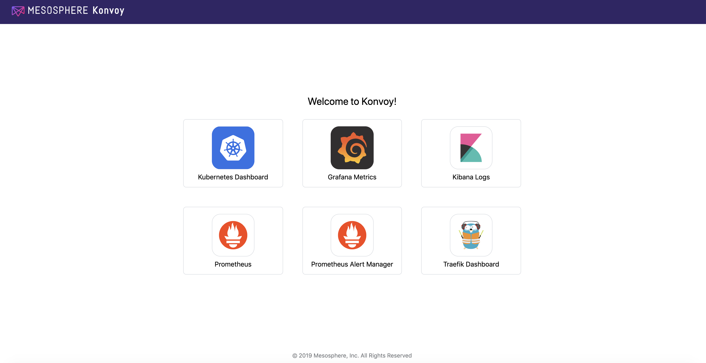
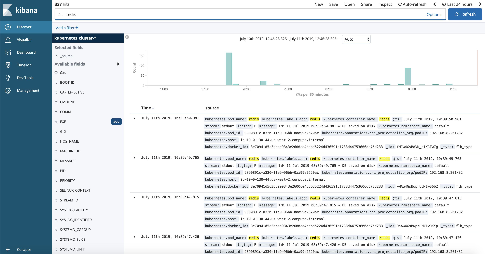
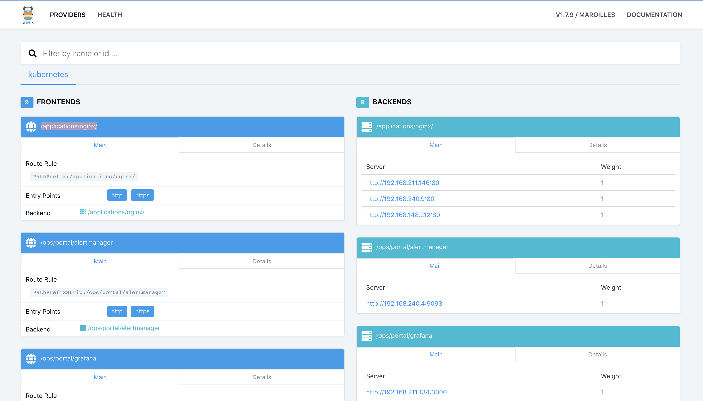
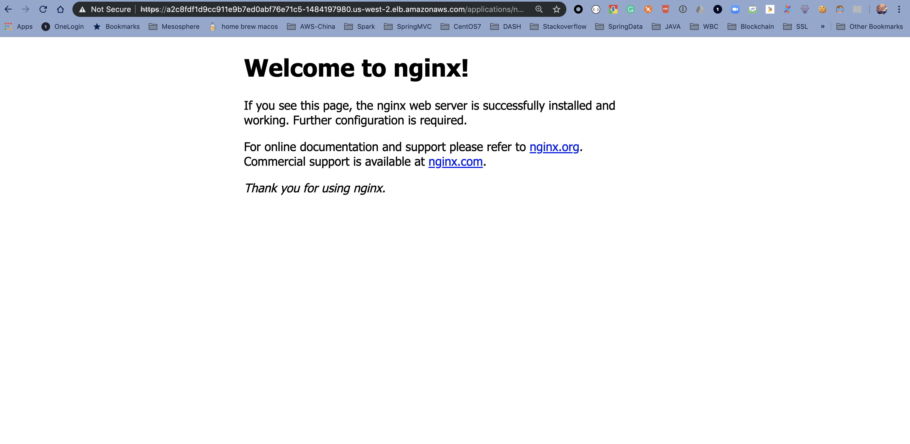

# Kubernetes Training

## Introduction

During this training, you'll learn how to deploy Konvoy and to use its main features:

* [Introduction](#introduction)
* [Prerequisites](#prerequisites)
* [1. Deploy a Konvoy cluster](#deploy-a-konvoy-cluster)
* [2. StatefulSets](#StatefulSets)
* [3. Leverage persistent storage using CSI](#leverage-persistent-storage-using-csi)
* [4. Deploy portworx for persistent storage](#deploy-portworx)
* [5. Deploy Jenkins using Helm](#deploy-jenkins-using-helm)
* [6. Deploy Apache Kafka using KUDO](#deploy-apache-kafka-using-kudo)
* [7. Moniotoring applications using Grafana](#Moniotoring-applications-using-Grafana)


## Prerequisites

You need either a Linux, MacOS or a Windows laptop.

## Jumpserver

Jumpservers have been deployed for each student with all prerequisites installed. First, go to the student data spreadsheet and select a host by entering your name.  Then, download the ssh-private-key (id_rsa_student#) and change the file permissions.  Finally, ssh to the ipaddress of your assigned jumpserver using the -i option to specify the identity file to be used.  The username for the Jumpserver is "centos".

For Mac and Linux clients you must change the permission on the file.
```
chmod 400 id_rsa_student#
```
```
ssh -i id_rsa_student# centos@jumpserver-ip-address
```


>For Windows, you need to use the [Google Cloud Shell](https://console.cloud.google.com/cloudshell).
Once your Google Cloud Shell has started, you will have to copy the contents of you id_rsa_student#.pem file to a local file in the cloud shell.  Then change the permission on the file and ssh into the jump host.


```
vi id_rsa_student#
```
```
chmod 400 id_rsa_student#
```
```
ssh -i id_rsa_student# centos@jumpserver-ip-address
```

## 1. Deploy a Konvoy cluster

### Objectives
- Deploy a Kubernetes cluster with all the addons you need to get a production ready container orchestration platform
- Configure kubectl to manage your cluster

### Why is this Important?
There are many ways to deploy a kubernetes cluster from a fully manual procedure to using a fully automated or opinionated SaaS. Cluster sizes can also widely vary from a single node deployment on your laptop, to thousands of nodes in a single logical cluster, or even across multiple clusters. Thus, picking a deployment model that suits the scale that you need as your business grows is important.


Change directories into the lab directory:

```
cd ~/lab
```

Deploy your cluster using the command below:

```bash
konvoy up --yes
```

The output should be similar to:

```                                                                
This process will take about 15 minutes to complete (additional time may be required for larger clusters), do you want to continue [y/n]: y

STAGE [Provisioning Infrastructure]

Initializing provider plugins...

...

Terraform has been successfully initialized!

...

STAGE [Deploying Enabled Addons]
helm                                                                   [OK]
dashboard                                                              [OK]
fluentbit                                                              [OK]
awsebscsiprovisioner                                                   [OK]
traefik                                                                [OK]
opsportal                                                              [OK]
kommander                                                              [OK]
prometheus                                                             [OK]
elasticsearch                                                          [OK]
dex                                                                    [OK]
elasticsearchexporter                                                  [OK]
kibana                                                                 [OK]
traefik-forward-auth                                                   [OK]
prometheusadapter                                                      [OK]
dex-k8s-authenticator                                                  [OK]
velero                                                                 [OK]

STAGE [Removing Disabled Addons]

Kubernetes cluster and addons deployed successfully!

Run `konvoy apply kubeconfig` to update kubectl credentials.

Navigate to the URL below to access various services running in the cluster.
  https://a7e039f1a05a54f45b36e063f5aee077-287582892.us-west-2.elb.amazonaws.com/ops/landing
And login using the credentials below.
  Username: goofy_einstein
  Password: tUeARRKxM8PfrIy2cjFc1jI0Hr2I0duzlttr1LzRTKoDooQJ0d1yyutjNv4NLHvy

If the cluster was recently created, the dashboard and services may take a few minutes to be accessible.
```

If you get any error during the deployment of the addons (it can happen with network connectivity issues), then, you can run the following command to redeploy them:

```
konvoy deploy addons --yes
```

As soon as your cluster is successfully deployed, the URL and the credentials to access your cluster are displayed. When you lauch your dashboard URL in your browser the first screen will ask you to select "login or generate token", select login and use the credentials provided.

If you need to get this information later, you can execute the command below:
```bash
konvoy get ops-portal
```



Click on the `Kubernetes Dashboard` icon to open it.


To configure kubectl to manage your cluster, you simply need to run the following command:

```
konvoy apply kubeconfig
```

You can check that the Kubernetes cluster has been deployed using the version `1.15.2` with 3 control nodes and 5 workers nodes

```bash
kubectl get nodes
```
The output should be similar to:
```bash
NAME                                         STATUS   ROLES    AGE   VERSION
ip-10-0-128-64.us-west-2.compute.internal    Ready    <none>   10m   v1.15.2
ip-10-0-129-247.us-west-2.compute.internal   Ready    <none>   10m   v1.15.2
ip-10-0-129-41.us-west-2.compute.internal    Ready    <none>   10m   v1.15.2
ip-10-0-129-88.us-west-2.compute.internal    Ready    <none>   10m   v1.15.2
ip-10-0-130-84.us-west-2.compute.internal    Ready    <none>   10m   v1.15.2
ip-10-0-193-118.us-west-2.compute.internal   Ready    master   11m   v1.15.2
ip-10-0-193-232.us-west-2.compute.internal   Ready    master   12m   v1.15.2
ip-10-0-194-21.us-west-2.compute.internal    Ready    master   13m   v1.15.2
```

## 2. Leverage persistent storage using CSI

### Objectives
- Create a PersistentVolumeClaim (pvc) to use the AWS EBS CSI driver
- Create a service that will use this PVC and dynamically provision an EBS volume
- Validate persistence

### Why is this Important?
The goal of CSI is to establish a standardized mechanism for Container Orchestration Systems to expose arbitrary storage systems to their containerized workloads. The CSI specification emerged from cooperation between community members from various Container Orchestration Systems including Kubernetes, Mesos, Docker, and Cloud Foundry.

By creating an industry standard interface, the CSI initiative sets ground rules in order to minimize user confusion. By providing a pluggable standardized interface, the community will be able to adopt and maintain new CSI-enabled storage drivers to their kubernetes clusters as they mature. Choosing a solution that supports CSI integration will allow your business to adopt the latest and greatest storage solutions with ease.

When Konvoy is deployed on AWS, a `StorageClass` is created automatically as you can see below:

1. Check to see if storageClass is available

```
kubectl get sc awsebscsiprovisioner -o yaml
```
Output:
```bash
apiVersion: storage.k8s.io/v1
kind: StorageClass
metadata:
  annotations:
    kubernetes.io/description: AWS EBS CSI provisioner StorageClass
    storageclass.kubernetes.io/is-default-class: "true"
  creationTimestamp: "2019-08-12T10:43:23Z"
  name: awsebscsiprovisioner
  resourceVersion: "1573"
  selfLink: /apis/storage.k8s.io/v1/storageclasses/awsebscsiprovisioner
  uid: 413745a0-ec52-4917-afb5-70bdf8f2a606
parameters:
  type: gp2
provisioner: ebs.csi.aws.com
reclaimPolicy: Delete
volumeBindingMode: WaitForFirstConsumer
```

2. Create the Kubernetes PersistentVolumeClaim using the following command:

```bash
cat <<EOF | kubectl create -f -
apiVersion: v1
kind: PersistentVolumeClaim
metadata:
  name: dynamic
spec:
  accessModes:
    - ReadWriteOnce
  storageClassName: awsebscsiprovisioner
  resources:
    requests:
      storage: 1Gi
EOF
```

Run the following command to check the status of the `PersistentVolumeClaim`:

```bash
kubectl describe pvc dynamic
```

Output:
```bash
Name:          dynamic
Namespace:     default
StorageClass:  awsebscsiprovisioner
Status:        Pending
Volume:        
Labels:        <none>
Annotations:   <none>
Finalizers:    [kubernetes.io/pvc-protection]
Capacity:      
Access Modes:  
VolumeMode:    Filesystem
Events:
  Type       Reason                Age               From                         Message
  ----       ------                ----              ----                         -------
  Normal     WaitForFirstConsumer  3s (x3 over 21s)  persistentvolume-controller  waiting for first consumer to be created before binding
Mounted By:  <none>
```

As you can see, it is waiting for a `Pod` to use it to provision the AWS EBS volume.

Create a Kubernetes Deployment that will use this `PersistentVolumeClaim` using the following command:

```bash
cat <<EOF | kubectl create -f -
apiVersion: apps/v1
kind: Deployment
metadata:
  name: ebs-dynamic-app
  labels:
    app: ebs-dynamic-app
spec:
  replicas: 1
  selector:
    matchLabels:
      app: ebs-dynamic-app
  template:
    metadata:
      labels:
        app: ebs-dynamic-app
    spec:
      containers:
      - name: ebs-dynamic-app
        image: centos:7
        command: ["/bin/sh"]
        args: ["-c", "while true; do echo \$(date -u) >> /data/out.txt; sleep 5; done"]
        volumeMounts:
        - name: persistent-storage
          mountPath: /data
      volumes:
      - name: persistent-storage
        persistentVolumeClaim:
          claimName: dynamic
EOF
```

Run the following command until the pod is running:

```bash
kubectl get pods
```

Check the content of the file `/data/out.txt` and note the first timestamp:

```bash
pod=$(kubectl get pods | grep ebs-dynamic-app | awk '{ print $1 }')
kubectl exec -i $pod cat /data/out.txt
```

Delete the Pod using the following command (it will take some time to complete):

```bash
kubectl delete pod $pod
```

The Deployment will recreate the pod automatically.

Run the following command until the pod is running:

```bash
kubectl get pods
```

Check the content of the file `/data/out.txt` and verify that the first timestamp is the same as the one noted previously:

```bash
pod=$(kubectl get pods | grep ebs-dynamic-app | awk '{ print $1 }')
kubectl exec -i $pod cat /data/out.txt
```

## 3. StatefulSets
#### Understanding inner working on a statefulset (sts)

Create a statefulset that deploys two replicas of an application called Web

```bash
cat <<EOF | kubectl create -f -
apiVersion: v1
kind: Service
metadata:
 name: nginx
 labels:
   app: nginx
spec:
 ports:
 - port: 80
   name: web
 clusterIP: None
 selector:
   app: nginx
---
apiVersion: apps/v1
kind: StatefulSet
metadata:
 name: web
spec:
 serviceName: "nginx"
 replicas: 2
 selector:
   matchLabels:
     app: nginx
 template:
   metadata:
     labels:
       app: nginx
   spec:
     containers:
     - name: nginx
       image: k8s.gcr.io/nginx-slim:0.8
       ports:
       - containerPort: 80
         name: web
       volumeMounts:
       - name: www
         mountPath: /usr/share/nginx/html
 volumeClaimTemplates:
 - metadata:
     name: www
   spec:
     accessModes: [ "ReadWriteOnce" ]
     resources:
       requests:
         storage: 1Gi
EOF
```
Output should be something similar to below 
```bash
service/nginx created
statefulset.apps/web created
```
A Stateful application often needs persistent storage that’s specific to each of its nodes. In Kubernetes, storage is provisioned through a Persistent Volume and Persistent Volume Claim that accesses it. The StatefulSet definition guarantees that each Pod has its storage by using the volumeClaimTemplates parameter. The volumeClaimTemplates automatically create a Persistent Volume Claim for each Pod. Let’s have a look. Since we we have storageClass defined earlier the aws based storage class is going to provision PV'f for us. 
```bash
kubectl get pvc
```
Output:
```bash
NAME        STATUS   VOLUME                                     CAPACITY   ACCESS MODES   STORAGECLASS   AGE
www-web-0   Bound    pvc-01c744cc-cbff-11e9-9e03-025000000001   1Gi        RWO            hostpath       51s
www-web-1   Bound    pvc-1c8e6c2e-cbff-11e9-9e03-025000000001   1Gi        RWO            hostpath       6s
```

```bash
kubectl get pv
```

Output:
```bash                                  
NAME                                       CAPACITY   ACCESS MODES   RECLAIM POLICY   STATUS   CLAIM               STORAGECLASS   REASON   AGE
pvc-01c744cc-cbff-11e9-9e03-025000000001   1Gi        RWO            Delete           Bound    default/www-web-0   hostpath                49s
pvc-1c8e6c2e-cbff-11e9-9e03-025000000001   1Gi        RWO            Delete           Bound    default/www-web-1   hostpath                13s
```

Lets check if they pods get a unique name when provisioned by a stateful set. 
```bash
kubectl get pods
NAME    READY   STATUS    RESTARTS   AGE
web-0   1/1     Running   0          3h7m
web-1   1/1     Running   0          3h6m              
```

How about an IP address ? Since we mentioned that we do not want a cluster IP. The nature headless less services should be direct resolution to actual pods. If we query the pod for the stateful service from pod running in the cluster, you should get a list of the pods running the cluster. 

Create an ephemeral Ubuntu Pod to run our tests:
```bash
kubectl run -i --tty ubuntu --image=ubuntu:18.04 --restart=Never -- bash -il
```
We’ll need to install dig to issue DNS queries:
```bash
root@ubuntu:/# apt update && apt install dnsutils
```
Now, let’s test the headless service by issuing a SRV request:
```bash
root@ubuntu:/# dig SRV nginx.default.svc.cluster.local

; <<>> DiG 9.11.3-1ubuntu1.8-Ubuntu <<>> SRV nginx.default.svc.cluster.local
;; global options: +cmd
;; Got answer:
;; WARNING: .local is reserved for Multicast DNS
;; You are currently testing what happens when an mDNS query is leaked to DNS
;; ->>HEADER<<- opcode: QUERY, status: NOERROR, id: 41247
;; flags: qr aa rd; QUERY: 1, ANSWER: 2, AUTHORITY: 0, ADDITIONAL: 3
;; WARNING: recursion requested but not available

;; OPT PSEUDOSECTION:
; EDNS: version: 0, flags:; udp: 4096
; COOKIE: 5c4ff0df2ede50ff (echoed)
;; QUESTION SECTION:
;nginx.default.svc.cluster.local. IN	SRV

;; ANSWER SECTION:
nginx.default.svc.cluster.local. 5 IN	SRV	0 50 80 web-0.nginx.default.svc.cluster.local.
nginx.default.svc.cluster.local. 5 IN	SRV	0 50 80 web-1.nginx.default.svc.cluster.local.

;; ADDITIONAL SECTION:
web-0.nginx.default.svc.cluster.local. 5 IN A	10.1.2.192
web-1.nginx.default.svc.cluster.local. 5 IN A	10.1.2.193

;; Query time: 0 msec
;; SERVER: 10.96.0.10#53(10.96.0.10)
;; WHEN: Sat Aug 31 18:30:42 UTC 2019
;; MSG SIZE  rcvd: 354
```
Clean up
```bash
kubectl delete sts web
kubectl delete svc nginx 
```


## 4. Role Based Access Control (RBAC)

1. Validate that you have admin access to k8s api-server:

```bash
# Validate that you can run kubectl against the api-server.
kubectl get pods -n kube-system

# Check that you have admin access to the k8s cluster.
kubectl config view
```
Output:
```bash
[centos@ip-10-0-1-198 demo-cluster]$ kubectl config view
apiVersion: v1
clusters:
- cluster:
    certificate-authority-data: DATA+OMITTED
    server: https://demo-cluster-9b1f-lb-control-46693284.us-west-2.elb.amazonaws.com:6443
  name: demo-cluster
contexts:
- context:
    cluster: demo-cluster
    user: demo-cluster-admin
  name: demo-cluster-admin@demo-cluster
current-context: demo-cluster-admin@demo-cluster
kind: Config
preferences: {}
users:
- name: demo-cluster-admin
  user:
    client-certificate-data: REDACTED
    client-key-data: REDACTED
```

2. Provision a service account for a an individual member ex john-smith

```bash
kubectl create serviceaccount john-sa
```
Output:
```bash
centos@ip-10-0-1-198 demo-cluster]$ kubectl create serviceaccount john-sa
serviceaccount/john-sa created
```

3. Bind the service account to the appropriate roles to grant privileges for actions you desire. In this case we are binding user John to an existing cluster role with edit permissions

```bash
kubectl create clusterrolebinding john-sa-binding --clusterrole=edit --serviceaccount=default:john-sa
```
Output:
```bash
[centos@ip-10-0-1-198 demo-cluster]$ kubectl create clusterrolebinding john-sa-binding --clusterrole=edit --serviceaccount=default:john-sa
clusterrolebinding.rbac.authorization.k8s.io/john-sa-binding created
```

#### Note
A. Whenever we create a service account, K8s api server creates a token for this service account by default so that this Service account can authenticate itself to the api-server. We are going to extract this token to access the cluster for external access. 

B. Above example uses default SA use this link to get creative and set up further custome roles as per your needs 
https://kubernetes.io/docs/reference/access-authn-authz/rbac/
`

4. Verify the secrets exist & Retrieve the token
```bash
kubectl get secrets
```
Output:
```bash
[centos@ip-10-0-1-198 demo-cluster]$ kubectl get secrets
NAME                  TYPE                                  DATA   AGE
default-token-x5nqv   kubernetes.io/service-account-token   3      38m
john-sa-token-xbtpv   kubernetes.io/service-account-token   3      4m11s
```

5. Verify the token is generated for service account by describing the secret be sure to use your own secret name
```bash
kubect describe secret <secret-name>
```
Output:

```bash
[centos@ip-10-0-1-198 demo-cluster]$ kubectl describe secret john-sa-token-xbtpv
Name:         john-sa-token-xbtpv
Namespace:    default
Labels:       <none>
Annotations:  kubernetes.io/service-account.name: john-sa
              kubernetes.io/service-account.uid: 6a7a78bf-d347-485f-b715-d24b692f4fd1

Type:  kubernetes.io/service-account-token

Data
====
ca.crt:     1025 bytes
namespace:  7 bytes
token:      eyJhbGciOiJSdY2NvdW50L3NlcnZpY2UtYWNjb3VudC5uYW1lIjoiam9obi1zYSIsImt1YmVybmV0ZXMuaW8vc2VydmljZWFjY291bnQvc2VydmljZS1hY2NvdW50LnVpZCI6IjZhN2E3OGJmLWQzNDctNDg1Zi1iNzE1LWQyNGI2OTJmNGZkMSIsInN1YiI6InN5c3RlbTpzZXJ2aWNlYW . . . [output snipped]
```

6. Add the token as an environmental variable(This would make reduce the hassale of copy pasting it over and over )
```bash
export TOKEN=$(kubectl get secret john-sa-token-rq4ls -o=jsonpath="{.data.token}" | base64 -d -i -)
```

7. Review your kubeconfig file, notice that it has only 1 user and 1 cluster defined in it. 
```bash
cat ~/.kube/config
```
Output:
```bash
[centos@ip-10-0-1-198 demo-cluster]$ cat ~/.kube/config
apiVersion: v1
clusters:
- cluster:
    certificate-authority-data: LS0tLS1CRUdJTiBbVFhZ2ovZU1XYz0KLS0tLS1FTkQgQ0VSVElGSUNBVEUtLS0tLQo= . . . [output snipped]
    server: https://demo-cluster-9b1f-lb-control-46693284.us-west-2.elb.amazonaws.com:6443
  name: demo-cluster
contexts:
- context:
    cluster: demo-cluster
    user: demo-cluster-admin
  name: demo-cluster-admin@demo-cluster
current-context: demo-cluster-admin@demo-cluster
kind: Config
preferences: {}
users:
- name: demo-cluster-admin
  user:
    client-certificate-data: LS0tLS1CRUdJTiBDRVJUSUZJQ0FURS0tLS0tCk1JSUM4akNDBVEUtLS0tLQo= . . . [output snipped]
```

8. Since we are going to be messing with config file that's vital for our line of communication with k8s cluster lets take a backup 
```bash
cp ~/.kube/config ~/.kube/config.old
```

9. Configure your kubeconfig file to include the service accounts you included. Below is the sample and make sure to include the token you generate to the token section. Since we are working with the same cluster you might need to add only new user john and his context like below

```bash
vim  ~/.kube/config
```
Note: You will need to add a context and user at the bottom as we are using the same cluster. Below you can see how it should look 

Output:
```bash
apiVersion: v1
clusters:
- cluster:
    certificate-authority-data: LS0tLS1CRUdJTiBDRVJUSUZJQ0FURS0tLS0tCk1JSUN5RENDQWJDZ0F3SUJBZ0lCQURBTkJna3Foa2lHOXcwQkFRc0ZBREFWTVJNd0VRWURWUVFERXdwcmRXSmwKY201bGRHVnpNQjRYRFRJd01EY3dPVEl6TWpjd01Wb1hEVE13TURjd056SXpNamN3TVZvd0ZURVRNQkVHQTFVRQpBeE1LYTNWaVpYSnVaWFJsY3pDQ0FTSXdEUVlKS29aSWh2Y05BUUVCQlFBRGdnRVBBRENDQVFvQ2dnRUJBTFNUCm1Xdm0wQ2NhbEMyaEw1RGhUVkJvVjZPaGR3d3B6c1BxaUJVcWNmV0UvRzlqTWMzcFVZc1JSMWlNbU0ycWF2VWIKaHZ0VnUxcW1WMXFpK1dLMGRQeEhPOXRwOU5XTm5pYm41Q3MrNVAvN3U2cUhxemlNckNIbFZwYjkrekZhdnRQSgpzWlFINUFUK0YrSzdUYkNpaHNpcG1BczMwclpINFNMYUJXSDF6VzJnMkszaXBNbHMzM2hPS043dkJWNEdoYXNlCnlPbU9xMW1NVHFZak5aSE01Yk5IbXNjdjlIcVQ5YkF4cU9PdEhPVzYrZWtlNkhteU9VdHpVa3UvV3VkaC9XdUIKbTh4RWl2UVBSUHVNak5xR3Z5RlZQTkl0aVFnb0U4QUFXaE1JZENLUC9kT05PVzNZRXgzb1RrN3JkNXhqZy91VQpoRVRuSUVMMWY5cVhIT2pmZ1JjQ0F3RUFBYU1qTUNFd0RnWURWUjBQQVFIL0JBUURBZ0trTUE4R0ExVWRFd0VCCi93UUZNQU1CQWY4d0RRWUpLb1pJaHZjTkFRRUxCUUFEZ2dFQkFFV1ZKYnEzMkVVc1U2M0lTWUJUQndqd1NyakEKYnYzOFp0dHlpenZYei82SHA2L0picXVFRCtkd1FneEpmYkZVY2FHT1U4eUtEYnM3emtSTlAvV0c0Z0tRb2hCTApOam1IZVVFc1ZXZnFoNEZOOUs5Z1F4WG5NbXo2cTd2TUVOVzhuMGRIU1FHY2wxanJGTGdNN1Z1Q2RPL0dEVTNxCmVEYm5xb2g5NkNMWDZCNUhCRTRBMUw5TDE4RTBYMTl4aTR0bXZiTm5uUFE2UXY2OU4zVGVLRzRrVUx3Zis1M3QKMzFFc0xxMlI2Y3QzRFhBcTRJdSs4R1cxUTdDSVJjVUpZSmtja3Y2YlFkWVVnNUlrVVk3NzVjeEFZbVdMRlRXagpyTHNZa3BEbzVhYXFOQ1dpMG9jNlZFUlFvUmxuOVcwMDZaMk14Zi9TMnhMZnUyMzZ5bVFhZ2ovZU1XYz0KLS0tLS1FTkQgQ0VSVElGSUNBVEUtLS0tLQo=
    server: https://demo-cluster-9b1f-lb-control-46693284.us-west-2.elb.amazonaws.com:6443
  name: demo-cluster
contexts:
- context:
    cluster: demo-cluster
    user: demo-cluster-admin
  name: demo-cluster-admin@demo-cluster
- context:
    cluster: demo-cluster
    user: john-sa
  name: john-sa@demo-cluster
current-context: john-sa@demo-cluster
kind: Config
preferences: {}
users:
- name: demo-cluster-admin
  user:
    client-certificate-data: LS0tLS1CRUdJTiBDRVJUSUZJQ0FURS0tLS0tCk. . . [output snipped]
    client-key-data: LS0tLS1CRUdJTiBSU0EgUFJJVkFURSBLRVktLS0tLQpNSUlFcFFJQkFBS0NBUUVBdUtzMl. . . [output snipped]
- name: john-sa
  user:
    token: eyJhbGciOiJSUzI1NiIsImtpZCI6ImFvOXlMTUJvSUEzSjRCeG5BLTNvZk15anB. . . [output snipped]
```
Here another sample which showcases slighty different kind of kubeconfig file which leverages different kinds of authentication methods. 
```bash
apiVersion: v1
clusters:
- cluster:
    certificate-authority: fake-ca-file
    server: https://1.2.3.4
  name: development
- cluster:
    insecure-skip-tls-verify: true
    server: https://5.6.7.8
  name: scratch
contexts:
- context:
    cluster: development
    namespace: frontend
    user: developer
  name: dev-frontend
- context:
    cluster: development
    namespace: storage
    user: developer
  name: dev-storage
- context:
    cluster: scratch
    namespace: default
    user: experimenter
  name: exp-scratch
current-context: ""
kind: Config
preferences: {}
users:
- name: developer
  user:
    client-certificate: fake-cert-file
    client-key: fake-key-file
- name: experimenter
  user:
    password: some-password
    username: exp
```

10. Once you have updated the kubeconfig file. You can validate list of contexts available to you using `kubectx`
```bash

kubectx
```
Output:
```bash
[centos@ip-10-0-1-198 demo-cluster]$ kubectx
demo-cluster-admin@demo-cluster
john-sa@demo-cluster
```
11. Lets switch the context using kubectx 
```bash
kubectx john-sa@demo-cluster
```
Run the kubectx command again to validate that you are now using John's context. It should be highlighted 
```bash
kubectx
```
Output:
```bash
[centos@ip-10-0-1-198 demo-cluster]$ kubectx
demo-cluster-admin@demo-cluster
john-sa@demo-cluster
```
12. Run commands to validate that you can query the resources

```bash
kubectl auth can-i get deployments

kubectl get pods 
```

#### this concludes RBAC LAB


## 5. Deploy Jenkins using Helm

Helm is a tool for managing Kubernetes charts. Charts are packages of pre-configured Kubernetes resources.

You can find many charts on the [Helm Hub](https://hub.helm.sh/).

In this lab, we'll deploy the [Jenkins Helm chart](https://hub.helm.sh/charts/stable/jenkins).


Initialize helm client on your workstation:

```bash
helm init
```
To deploy the chart, you need to run the following command:
```bash
helm install stable/jenkins --name jenkins --version 1.5.0 --set master.adminPassword=password
```

The output should be similar to:
```bash
NAME:   jenkins
LAST DEPLOYED: Wed Aug  7 17:21:32 2019
NAMESPACE: default
STATUS: DEPLOYED

RESOURCES:
==> v1/ConfigMap
NAME           DATA  AGE
jenkins        5     1s
jenkins-tests  1     1s

==> v1/Deployment
NAME     READY  UP-TO-DATE  AVAILABLE  AGE
jenkins  0/1    1           0          1s

==> v1/PersistentVolumeClaim
NAME     STATUS   VOLUME                CAPACITY  ACCESS MODES  STORAGECLASS  AGE
jenkins  Pending  awsebscsiprovisioner  1s

==> v1/Pod(related)
NAME                     READY  STATUS   RESTARTS  AGE
jenkins-c79f457cb-ccttb  0/1    Pending  0         1s

==> v1/Role
NAME                     AGE
jenkins-schedule-agents  1s

==> v1/RoleBinding
NAME                     AGE
jenkins-schedule-agents  1s

==> v1/Secret
NAME     TYPE    DATA  AGE
jenkins  Opaque  2     1s

==> v1/Service
NAME           TYPE          CLUSTER-IP  EXTERNAL-IP  PORT(S)         AGE
jenkins        LoadBalancer  10.0.9.26   <pending>    8080:30323/TCP  1s
jenkins-agent  ClusterIP     10.0.41.64  <none>       50000/TCP       1s

==> v1/ServiceAccount
NAME     SECRETS  AGE
jenkins  1        1s
```

Then, run the following command to get the URL of the Load Balancer created on AWS for this service:

```bash
kubectl get svc jenkins
```

The output should be similar to:
```bash
NAME      TYPE           CLUSTER-IP   EXTERNAL-IP                                                              PORT(S)          AGE
jenkins   LoadBalancer   10.0.9.26    a71b8025991124a90b2babf7ba2a75da-492974167.us-west-2.elb.amazonaws.com   8080:30323/TCP   16m
```

You need to wait for a few minutes while the Load Balancer is created on AWS and the name resolution in place.

```bash
until nslookup $(kubectl get svc jenkins --output jsonpath={.status.loadBalancer.ingress[*].hostname})
do
  sleep 5
done
echo "Open http://$(kubectl get svc jenkins --output jsonpath={.status.loadBalancer.ingress[*].hostname}):8080 to access the Jenkins UI"
```

Go to the URL displayed to access Jenkins.

Login with the user `admin` and the password `password`.

Delete the Jenkins Deployment using Helm
```bash
helm delete jenkins --purge
```


## 5. Kubernetes logging/debugging

In Konvoy, all the logs are stored in an Elasticsearch cluster and exposed through Kibana.

To access the Kibana UI, click on the `Kibana Logs` icon on the Konvoy UI.


By default, it only shows the logs for the latest 15 minutes.

Click on the top right corner and select `Last 24 hours`.

Then, search for `redis`:



You'll see all the logs related to the redis Pod and Service you deployed previously.

### 6. Ingress troubleshooting.

In this section, we will leverage Konvoy logging to troubleshoot Ingress failure issue.

We will deploy a nginx application and expose it via L7 loadbalancer. The application can be accessed with URLs follows below patten.

`http[s]://$(kubectl get svc traefik-kubeaddons -n kubeaddons --output jsonpath="{.status.loadBalancer.ingress[*].hostname}")/applications/nginx/`

* 1st, let's deploy a nginx application and scale it to 3

```bash
kubectl run --image=nginx --replicas=3 --port=80 --restart=Always nginx
```
* 2nd, expose a in cluster service

```bash
kubectl expose deploy nginx --port 8080 --target-port 80 --type NodePort --name "svc-nginx"
```
* 3rd, create a ingress to expose service via Layer7 LB

```bash
cat << EOF | kubectl apply -f -
apiVersion: extensions/v1beta1
kind: Ingress
metadata:
  name: nginx-root
  namespace: default
spec:
  rules:
  - http:
      paths:
      - backend:
          serviceName: svc-nginx
          servicePort: 8080
        path:  /applications/nginx/
EOF
```
* 4th, Now check Ingress configure in Traefik



The `Traefik dashboard` indicates the nginx application is ready to receive traffic but if you try access nginx with URL listed below, you will notice `404 Not Found` error like:

```bash
curl -k https://$(kubectl get svc traefik-kubeaddons -n kubeaddons --output jsonpath="{.status.loadBalancer.ingress[*].hostname}")/applications/nginx/
```

Don't forget the trailing slash at the end of the URL. Otherwise, you won't generate a 404 error.

If you would like to see the error in the browser, get the Loadbalancer's endpoint
```bash
kubectl get svc traefik-kubeaddons -n kubeaddons --output jsonpath="{.status.loadBalancer.ingress[*].hostname}"
```
Output should give you the AWS-ELB endpoint use that in the browser like below:
https://{endpoint}/applications/nginx/


Let's troubleshoot this failure with Konvoy Kibana.


With Konvoy Kibana's near real time log collection and indexing, we can easily identify the ingress traffic was eventually handled by a pod `kubernetes.pod_name:nginx-755464dd6c-dnvp9` in nginx service. The log also gave us more information on the failure, `"GET /applications/nginx/ HTTP/1.1" 404`, which tell us that nginx can't find resource at path `/applications/nginx/`.

That is neat! Because w/o Kibana, you wouldn't know which Pod in our nginx service handles this request. (Our nginx deployment example launched 3 Pods to serve HTTP request) Not mention if there are multiple nginx service exists in the same K8s cluster but hosted at different namespace.

To fix this failure requires some knownledge on Nginx configuration. In general, when nginx is launched with default configuration, it serves a virtual directory on its `ROOT` path `(/)`. When receives HTTP requests, the nginx walk through its virtual directory to return back resources to the client.

In terms of out example, the `Ingress` configuration we submitted to k8s was configured to a path at `/applications/nginx/`. The `traefik` ingress controller sees this `Ingress configuration` and forwards any resource request at path `/applications/nginx/` to the down stream nginx service at the same path. The pod `kubernetes.pod_name:nginx-755464dd6c-dnvp9` received this request but nginx instance in this pod failed to locate any resource under path `/applications/nginx/`. That is the reason we saw this failure, `"GET /applications/nginx/ HTTP/1.1" 404`.  

You can, of course, configure nginx instance to serve resources at path `/applications/nginx/`. But an alternative solution is leverage `traefik` to strip PATH `/applications/nginx/` to `ROOT (/)` before route requests to nginx.

According to `Traefik` documentation [PathPrefixStrip](https://docs.traefik.io/configuration/backends/kubernetes/), the annotation `(traefik.ingress.kubernetes.io/rule-type)` is exactly what we need to direct traefik to strip ingress HOST PATH to ROOT PATH forementioned.

To update `Ingress`, we can use below command.

```bash
cat << EOF | kubectl apply -f -
apiVersion: extensions/v1beta1
kind: Ingress
metadata:
  annotations:
    traefik.frontend.rule.type: PathPrefixStrip
  name: nginx-root
  namespace: default
spec:
  rules:
  - http:
      paths:
      - backend:
          serviceName: svc-nginx
          servicePort: 8080
        path:  /applications/nginx/
EOF
```

## 7. Monitoring 


In Konvoy, all the metrics are stored in a Prometheus cluster and exposed through Grafana.

To access the Grafana UI, click on the `Grafana Metrics` icon on the Konvoy UI.

Take a look at the different Dashboards available.


You can also access the Prometheus UI to see all the metrics available by clicking on the `Prometheus` icon on the Konvoy UI.


The KUDO Kafka operator comes by default the JMX Exporter agent enabled.

When Kafka operator deployed with parameter `METRICS_ENABLED=true` (which defaults to `true`) then:

- Each broker bootstraps with [JMX Exporter](https://github.com/prometheus/jmx_exporter) java agent exposing the metrics at `9094/metrics`
- Adds a port named `metrics` to the Kafka Service
- Adds a label `kubeaddons.mesosphere.io/servicemonitor: "true"` for the service monitor discovery.

Run the following command to enable Kafka metrics export:

```bash
kubectl create -f https://raw.githubusercontent.com/kudobuilder/operators/master/repository/kafka/docs/v0.1/resources/service-monitor.yaml
```

In the Grafana UI, click on the + sign on the left and select `Import`.

Copy the content of this [file](https://raw.githubusercontent.com/kudobuilder/operators/master/repository/kafka/docs/v0.1/resources/grafana-dashboard.json) as shown in the picture below.


Click on `Load`.


Select `Prometheus` in the `Prometheus` field and click on `Import`.


